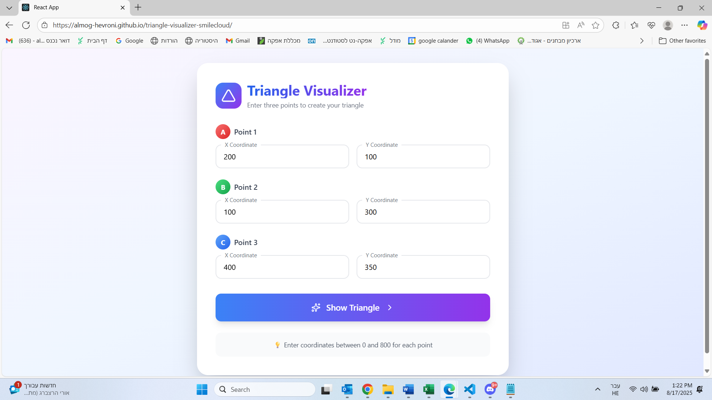
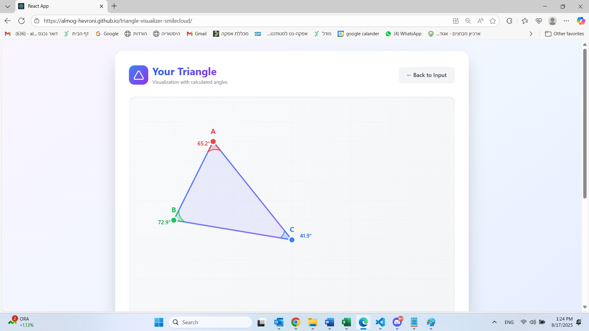
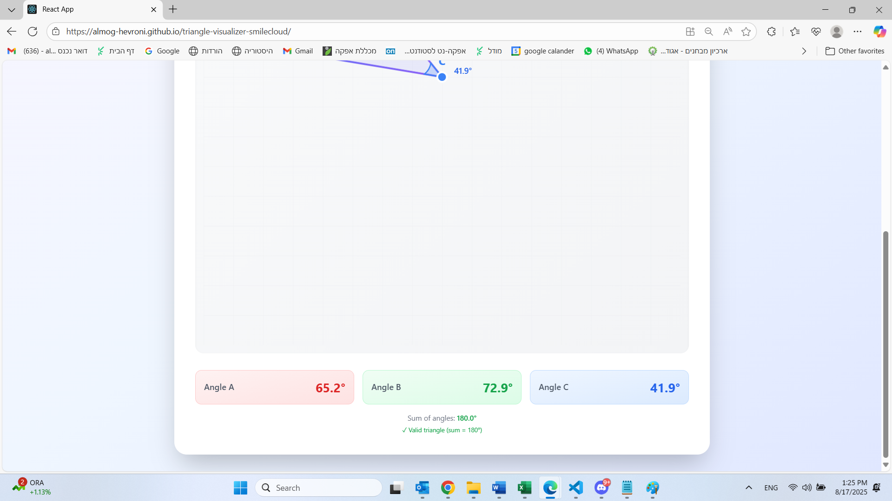

# 🔺 Triangle Visualizer

Triangle visualization project with angle calculations - SmileCloud recruitment assignment

## 🌐 **Live Demo**

### **[👉 Click here to view the application](https://almog-hevroni.github.io/triangle-visualizer-smilecloud)**

---

## 🚀 **Local Installation (Optional)**

To run the project locally:

```bash
# 1. Clone the repository
git clone https://github.com/YOUR_USERNAME/triangle-visualizer-smilecloud.git

# 2. Navigate to project directory
cd triangle-visualizer-smilecloud

# 3. Install dependencies
npm install

# 4. Start the application
npm start
```

The application will run on [http://localhost:3000](http://localhost:3000)

---

## 📸 **Preview**

### Input Page



### Display Page




## ✨ **Features**

- ✅ **Intuitive Input Interface** - Enter 3 points with validation
- ✅ **Accurate Visualization** - Triangle rendering with SVG
- ✅ **Angle Calculations** - Precise mathematical calculations using vectors
- ✅ **Modern Design** - Impressive UI with animations
- ✅ **TypeScript** - Type safety and quality code

## 🛠 **Technologies**

- React 18 + TypeScript
- Tailwind CSS
- SVG Graphics
- Lucide Icons

## 📊 **Assignment Answers**

### 1. Which method did I use to draw the triangle? Why did I choose it?

I used **SVG (Scalable Vector Graphics)** with modular React components:

- **SVG polygon** - for drawing the triangle itself
- **SVG path with Arc commands** - for drawing angle arcs
- **SVG circles and text** - for marking points

**Why I chose this method:**

- Perfect mathematical precision when working with coordinates
- Excellent performance and smooth rendering
- Full support for CSS animations
- Easy to add graphical elements like grids and gradients

### 2. How did I calculate the angle values?

I used the **vector dot product method**:

```typescript
// Create vectors from vertex to points
const v1 = { x: p1.x - vertex.x, y: p1.y - vertex.y };
const v2 = { x: p2.x - vertex.x, y: p2.y - vertex.y };

// Calculate dot product and determinant
const dot = v1.x * v2.x + v1.y * v2.y;
const det = v1.x * v2.y - v1.y * v2.x;

// Calculate angle using atan2
let angle = Math.atan2(det, dot) * (180 / Math.PI);
```

This method is accurate and correctly handles all angle types (acute, obtuse, right).

### 3. What was challenging in the exercise?

- **Modular Architecture**: Proper component separation with separation of concerns
- **Precise SVG Calculations**: Creating paths for arcs with correct parameters
- **Impressive UX/UI Design**: Creating smooth user experience with animations and visual feedback
- **TypeScript Typing**: Defining proper interfaces for all data types

### 4. Is there anything I couldn't solve? What gaps did I have?

The solution is functional and meets the requirements. I successfully implemented:

- ✅ Validation that points form a valid triangle
- ✅ Smooth transition animations
- ✅ Angle sum display (180°)
- ✅ Responsive design

**Known Issues:**

- **Canvas boundary overflow**: When using smaller coordinate values (e.g., points close to 0,0), the triangle and angle arcs can extend beyond the visible canvas boundaries. The SVG viewBox is fixed at 800x800, but doesn't dynamically adjust to keep all elements visible.
- **No dynamic scaling**: The visualization doesn't automatically scale or center the triangle within the available space.

**If I had more time, I would add:**

- Dynamic viewBox calculation to ensure the triangle always fits within bounds
- Auto-scaling and centering of the triangle
- Padding adjustments to prevent angle labels from being cut off
- Mobile support with touch events
- Drag and drop functionality for points on canvas
- Side length calculations and triangle type identification
- Export to PNG/SVG

### 5. Did I use external aids (including AI)?

**Yes, I used:**

- **AI (Claude)** - for assistance with architecture, optimization, and best practices
- **MDN Documentation** - for SVG paths documentation
- **React Docs** - for checking Hooks and patterns
- **Tailwind Docs** - for quick styling

**How AI helped:**

- Planning the modular project structure
- Optimizing mathematical calculations
- Creating modern and impressive design
- Writing clean code with TypeScript

---

## 👨‍💻 **Author**

Developed for SmileCloud recruitment process - Full-Stack Developer Position

**Development time:** 1.5 hours (as required in the assignment)

---

💡 **Note:** The application is available for direct viewing at the link above, no installation or local setup required.
